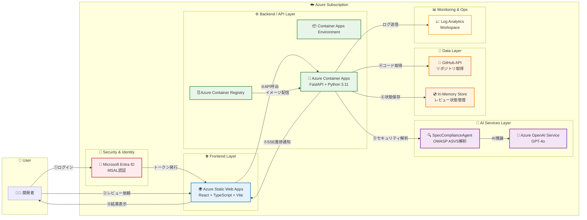
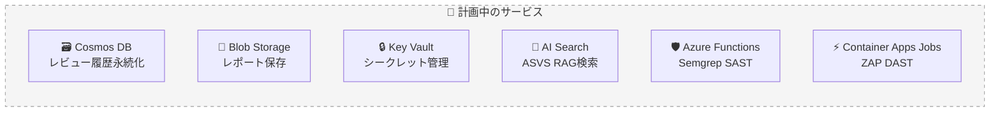

# アーキテクチャ図

> **アプリ名**: AI Security Reviewer
> **アプリ概要**: GitHubリポジトリのソースコードをAIエージェントが自動でセキュリティレビューし、OWASP ASVS準拠のレポートを生成するWebサービス
> **ハッカソン名**: Microsoft AI Hackathon 2026

## システム構成

## 各コンポーネントの役割

| サービス | 役割 |
|----------|------|
| 🌍 Azure Static Web Apps | React SPAのホスティング。グローバルCDN配信、自動HTTPS |
| 🐳 Azure Container Apps | FastAPI バックエンドのサーバーレスコンテナ実行。オートスケール対応 |
| 🗄️ Azure Container Registry | Dockerイメージの格納・配信。ACR Buildでクラウドビルド |
| 🧠 Azure OpenAI Service | GPT-4oモデルによるコードセキュリティ解析・脆弱性検出 |
| 🔍 SpecComplianceAgent | OWASP ASVS基準に基づくセキュリティ評価を実行するAIエージェント |
| 🐙 GitHub API | 指定リポジトリからソースコードを取得 |
| 💿 In-Memory Store | レビューセッションの状態・進捗・結果を一時保存（MVP用） |
| 🔑 Microsoft Entra ID | OAuth2/OIDCによるユーザー認証。MSAL.jsでSPA連携 |
| 📈 Log Analytics Workspace | Container Appsのログ収集・監視 |

## 技術スタック詳細

### フロントエンド
| 技術 | バージョン | 用途 |
|------|-----------|------|
| React | 19.x | UIフレームワーク |
| TypeScript | 6.x | 型安全なJavaScript |
| Vite | 8.x | 高速ビルドツール |
| Tailwind CSS | 3.x | ユーティリティファーストCSS |
| MSAL React | 5.x | Azure AD認証ライブラリ |
| React Router | 7.x | SPAルーティング |

### バックエンド
| 技術 | バージョン | 用途 |
|------|-----------|------|
| Python | 3.11 | 実行環境 |
| FastAPI | latest | REST API フレームワーク |
| Uvicorn | latest | ASGIサーバー |
| Azure OpenAI SDK | 1.x | GPT-4o API連携 |
| SSE-Starlette | latest | Server-Sent Events |
| OpenPyXL | 3.x | Excelレポート生成 |

## データフロー

1. **ユーザー認証**: 開発者がMicrosoft Entra IDでログイン、MSALがアクセストークンを取得
2. **レビュー依頼**: フロントエンドからGitHubリポジトリURLを指定してレビューをリクエスト
3. **コード取得**: バックエンドがGitHub APIを使用してリポジトリのソースコードを取得
4. **AI解析**: SpecComplianceAgentがAzure OpenAI (GPT-4o)を使用してOWASP ASVS基準でセキュリティ解析を実行
5. **進捗通知**: 解析の進捗状況をSSE (Server-Sent Events)でリアルタイムにフロントエンドへ配信
6. **結果表示**: 脆弱性の検出結果、重要度分類、修正提案をダッシュボードに表示
7. **レポート出力**: Excel形式でのレビュー結果エクスポートが可能

## デプロイ構成

| リソース | 名前 | リージョン | SKU |
|----------|------|-----------|-----|
| Resource Group | rg-aisecreviewer-dev | Japan East | - |
| Static Web Apps | swa-aisecreviewer-dev | East Asia | Free |
| Container Apps | ca-aisecreviewer-api-dev | Japan East | Consumption |
| Container Registry | craisecreviewer | Japan East | Basic |
| OpenAI Service | oai-aisecreviewer-dev | Japan East | S0 |
| Log Analytics | workspace-* | Japan East | - |

## 将来の拡張予定

| 計画サービス | 目的 |
|-------------|------|
| Azure Cosmos DB | レビュー履歴・指摘事項の永続化 |
| Azure Blob Storage | PDF/Excelレポートの保存 |
| Azure Key Vault | APIキー・シークレットの安全な管理 |
| Azure AI Search | ASVS要件のRAG検索 |
| Azure Functions | Semgrep静的解析の実行 |
| Container Apps Jobs | ZAP動的スキャンの実行 |
