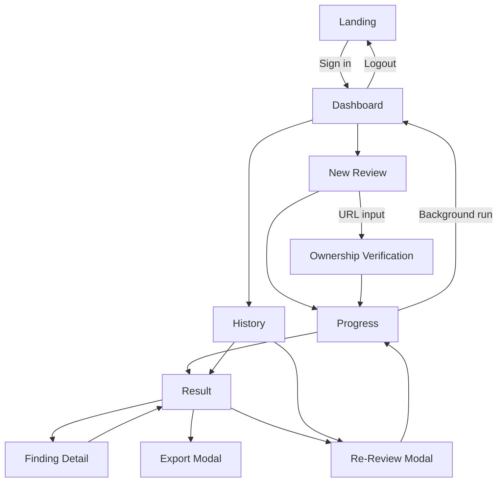

# Feature Specification: AI Security Reviewer Complete Product Specification

**Feature Branch**: `001-before-specify-hook`

**Created**: 2026-05-26

**Last Updated**: 2026-05-31

**Status**: Draft

**Input**: User description: "Complete specification for AI Security Reviewer aligned with mockup and constitution v1.1.0"

## Project Overview

AI Security Reviewer is a web service that automates security reviews of web applications
developed through Spec-Driven Development. The service is positioned as a corporate
project and targeted for Microsoft AI Hackathon submission by 2026-06-01.

The product provides security assessment across three perspectives:
- ASVS-based specification and implementation coverage review
- SAST-based static findings review and prioritization
- DAST-based optional dynamic scan for ownership-verified URLs

Each perspective supports three depth levels (quick, standard, detailed) with
measurably different scope, execution time, and cost characteristics.

The product value proposition is rapid, evidence-backed security review that a judge can
understand in 3 minutes, with live progress visibility during execution.

## User Scenarios & Testing *(mandatory)*

### User Story 1 - GitHub Repository Security Review (Priority: P1)

As a developer, I want to submit a public GitHub repository URL and receive an automated
security review report aligned with OWASP ASVS.

**Why this priority**: This is the core business flow and the main demo path.

**Independent Test**: Submit a valid public repository and verify report delivery with
judgment, ASVS basis, and remediation guidance.

**Acceptance Scenarios**:

1. **Given** an authenticated user on the New Review screen, **When** they enter a
   public GitHub URL and start review, **Then** the review starts successfully.
2. **Given** a started GitHub review, **When** processing completes, **Then** a report
   is available within 10 minutes and includes perspective-specific judgments, ASVS
   evidence references, and improvement proposals.

---

### User Story 2 - Direct Code Review by Paste (Priority: P2)

As a developer, I want to paste source code directly to run a review without repository
access.

**Why this priority**: Supports rapid validation and fallback when repository access is
not available.

**Independent Test**: Paste source code with optional filename/language and confirm
review execution for inputs up to 10,000 lines.

**Acceptance Scenarios**:

1. **Given** an authenticated user, **When** they select code input and paste up to
   10,000 lines, **Then** review starts and completes with findings.
2. **Given** code input with `language="auto"`, **When** review starts, **Then** system
   detects language using filename, shebang, and content heuristics in priority order.
3. **Given** explicit language selection (JavaScript/TypeScript/Python/Java/Go),
   **When** review starts, **Then** system uses selected language regardless of
   content analysis.

---

### User Story 3 - Optional Dynamic Scan with Ownership Verification (Priority: P3)

As a developer, I want to run dynamic scans only for websites I own.

**Why this priority**: Important for coverage, but optional for MVP core path.

**Independent Test**: Attempt scan without ownership proof (must fail), then provide
proof and execute baseline/full scan with bounded duration.

**Acceptance Scenarios**:

1. **Given** a target URL with no ownership proof, **When** dynamic scan is requested,
   **Then** scan is blocked.
2. **Given** verified ownership, **When** baseline or full scan is selected, **Then**
   the scan completes within target duration limits.
3. **Given** verification method "HTML meta tag" is selected, **When** user adds
   `<meta name="ai-sec-reviewer-verification" content="<token>"/>` to site root,
   **Then** system fetches and verifies presence within 30 seconds.
4. **Given** verification method "DNS TXT" is selected, **When** user adds
   `_aisecreviewer.<domain> IN TXT "<token>"`, **Then** system queries DNS and
   verifies within 60 seconds (DNS propagation considered).
5. **Given** verification token expires after 24 hours, **When** user retries an
   expired token, **Then** system generates a new token and re-verification required.

---

### User Story 4 - Integrated Static Analysis (Priority: P2)

As a developer, I want static analysis findings integrated with AI interpretation.

**Why this priority**: Raises practical accuracy and actionable priority setting.

**Independent Test**: Run review with static analysis enabled and confirm integrated,
prioritized findings with false-positive flags.

**Acceptance Scenarios**:

1. **Given** static analysis is enabled, **When** review completes, **Then** findings
   include severity, AI explanation, and potential false-positive flags.

---

### User Story 5 - Finding Detail Inspection (Priority: P2)

As a developer, I want to inspect each finding in detail with fix guidance.

**Why this priority**: Converts detection into concrete remediation action.

**Independent Test**: Open a finding detail and confirm vulnerable code highlight,
attack explanation, copyable fix suggestion, ASVS/CWE mapping, and references.

**Acceptance Scenarios**:

1. **Given** a report with findings, **When** a finding is opened, **Then** all detail
   components are visible and usable.

---

### User Story 6 - In-Screen Resolution State Management (Priority: P2)

As a developer, I want to mark findings as resolved/unresolved for progress tracking.

**Why this priority**: Enables review workflow management for demonstrations.

**Independent Test**: Toggle finding state in detail view and confirm summary view
updates immediately within the same session.

**Acceptance Scenarios**:

1. **Given** a finding detail view, **When** "mark resolved" is selected, **Then** the
   finding state updates and summary indicators reflect the change.
2. **Given** a resolved finding, **When** "mark unresolved" is selected, **Then** the
   state returns to unresolved.

---

### User Story 7 - Review History Search and Filtering (Priority: P2)

As a developer, I want to search and filter prior reviews quickly.

**Why this priority**: Supports repeated usage and comparative review operations.

**Independent Test**: Filter history by repository name, period, score range, and
perspective; verify result counts and empty-state messaging.

**Acceptance Scenarios**:

1. **Given** multiple historical reviews, **When** filters are applied, **Then** list
   and count update dynamically.
2. **Given** no matching reviews, **When** filters are applied, **Then** an explicit
   no-results message is shown.

---

### User Story 8 - Re-Review with Preserved Context (Priority: P2)

As a developer, I want to rerun review with prior repository settings preserved.

**Why this priority**: Improves iterative security remediation flow.

**Independent Test**: Start rerun from history/result, keep repository fixed, adjust
perspectives and depth, and confirm estimated duration updates.

**Acceptance Scenarios**:

1. **Given** a previous review entry, **When** rerun is initiated, **Then** repository
   metadata is read-only and configurable settings are editable.

---

### User Story 9 - Report Export (Priority: P3)

As a developer, I want to export review output in common document formats.

**Why this priority**: Important for sharing and judging, but not blocking core review.

**Independent Test**: Open export modal, choose format and sections, download output,
and verify content subset accuracy.

**Acceptance Scenarios**:

1. **Given** a completed review, **When** export options are selected, **Then** the
   generated file includes only selected sections in chosen format.

---

### User Story 10 - Entra ID Authentication (Priority: P1)

As a developer, I want to sign in and sign out with Microsoft Entra ID.

**Why this priority**: Mandatory security and access control baseline.

**Independent Test**: Sign in from landing, verify authenticated header identity,
sign out, and confirm return to landing state.

**Acceptance Scenarios**:

1. **Given** an unauthenticated visitor, **When** sign-in succeeds, **Then** the user
   is routed to authenticated home.
2. **Given** an authenticated session, **When** sign-out is requested, **Then** session
   ends and landing screen is shown.

---

### User Story 11 - Dashboard Home (Priority: P1)

As a developer, I want a dashboard with immediate project status and CTA.

**Why this priority**: Primary post-login orientation and demo anchor.

**Independent Test**: Load dashboard and verify key statistics, recent reviews
(maximum 3), and start-review CTA behavior.

**Acceptance Scenarios**:

1. **Given** an authenticated user, **When** dashboard opens, **Then** headline stats,
   recent reviews, and start CTA are visible.

---

### User Story 12 - Theme Switching (Priority: P3)

As a developer, I want dark/light theme switching with persistence.

**Why this priority**: Required for UX quality and judging preference fit.

**Independent Test**: Toggle theme from header and verify immediate full-screen style
change and persistence across reload.

**Acceptance Scenarios**:

1. **Given** any authenticated screen, **When** theme is toggled, **Then** visual theme
   switches instantly.
2. **Given** a selected theme, **When** user revisits later, **Then** same theme is
   restored.

---

### User Story 13 - Real-Time AI Agent Visibility (Priority: P1)

As a developer, I want real-time visibility of multi-agent review execution.

**Why this priority**: Critical differentiation and judge-facing value proof.

**Independent Test**: Start a review and verify global progress, per-agent states,
per-agent progress, and live log updates.

**Acceptance Scenarios**:

1. **Given** a running review, **When** agents process tasks, **Then** global and
   per-agent status updates stream continuously.
2. **Given** long-running review, **When** user navigates within authenticated area,
   **Then** AI agent status remains visible via persistent status indicator.

---

### User Story 14 - Review Depth Behavior Differentiation (Priority: P1)

As a developer, I want each review depth (quick/standard/detailed) to produce
measurably different behavior in scope, time, and cost, so I can choose the right
level for my use case.

**Why this priority**: Currently depth is selectable but behavior is not
differentiated. This makes the depth feature meaningful and provides user choice.

**Independent Test**: Run the same input through all 3 depths per perspective
(ASVS/SAST/DAST) and verify scope coverage, execution time, and finding counts scale
appropriately.

**Acceptance Scenarios**:

1. **Given** ASVS perspective + Quick depth, **When** review runs on a 50-file
   repository, **Then** at most 10 files analyzed with ASVS V1/V2/V5 coverage
   completing in approximately 1 minute.
2. **Given** ASVS perspective + Standard depth (default), **When** same input,
   **Then** up to 30 files analyzed with ASVS V1-V7 coverage in approximately
   3 minutes.
3. **Given** ASVS perspective + Detailed depth, **When** same input, **Then**
   up to 100 files analyzed with ASVS V1-V14 complete coverage in approximately
   10 minutes.
4. **Given** SAST perspective + Quick depth, **When** review runs, **Then**
   Semgrep `p/security-audit` ruleset applied to maximum 10 files in ~30 seconds.
5. **Given** SAST perspective + Detailed depth, **When** review runs, **Then**
   full Semgrep ruleset applied with LLM-based false positive filtering to up
   to 200 files.
6. **Given** DAST perspective + Quick depth, **When** scan runs on verified URL,
   **Then** passive scan only on top 5 URLs in ~2 minutes.
7. **Given** DAST perspective + Detailed depth, **When** scan runs on verified URL,
   **Then** full active scan on up to 200 URLs in ~1 hour with all attack vectors.

### Edge Cases

- Invalid or private GitHub URL submitted as public repository input.
- Unsupported language or empty source paste submitted.
- Pasted input exceeding 10,000 lines.
- Ownership verification token not found, expired, or mismatched.
- DAST request attempted against third-party domain.
- Review interrupted by client navigation while server-side execution continues.
- Concurrent history filters resulting in zero records.
- Export requested before report completion.
- Theme preference unavailable in restricted browser storage.
- Re-review initiated when original repository branch no longer exists.
- Invalid perspective × input type combination (e.g., DAST with GitHub input).
- Code paste with no detectable language and no filename hint provided.
- DAST verification token expires during active scan execution.

## Security and Safety Constraints *(mandatory)*

- Authentication MUST use Microsoft Entra ID for all human-facing access paths.
- User input validation rules MUST be defined for every external input surface.
- AI-bound payload sanitization rules MUST be defined for prompts and tool inputs.
- DAST scanning flows MUST define URL ownership verification before scan execution.
- Secret handling MUST use Azure Key Vault references only.
- Sensitive artifacts (credentials, customer data, non-public source code) MUST be
  classified and excluded from repository commits.

## AI and Evidence Requirements *(mandatory)*

- Feature behavior MUST define collaborating agent roles; single-prompt-only core
  review logic is not allowed.
- Each security finding MUST define evidence fields and normative mapping
  requirements (for example ASVS identifiers).
- LLM outputs MUST define verification steps against tool execution results.

## Requirements *(mandatory)*

### Functional Requirements

- **FR-001**: The system MUST provide an authenticated landing flow with Microsoft
  sign-in as primary action.
- **FR-002**: The system MUST restrict all post-login screens to authenticated users.
- **FR-003**: The dashboard MUST display total reviews, total findings, resolved
  findings, and average score.
- **FR-004**: The dashboard MUST display at most three recent reviews.
- **FR-005**: The dashboard MUST provide a direct action to start a new review.
- **FR-006**: New review MUST support three target types: GitHub repository,
  source paste, and URL dynamic scan.
- **FR-007**: GitHub review input MUST accept a repository URL and branch name.
- **FR-008**: Branch input MUST default to `main` when not specified.
- **FR-009**: GitHub review MUST support automatic language detection with priority
  handling for JavaScript, TypeScript, and Python.
- **FR-010**: Code paste review MUST accept optional filename and language hints.
- **FR-011**: Code paste review MUST reject payloads larger than 10,000 lines.
- **FR-012**: URL scan review MUST require ownership verification before scanning.
- **FR-013**: Ownership verification MUST support either HTML meta-tag or DNS TXT
  method.
- **FR-014**: URL scans MUST offer baseline and full scan modes.
- **FR-015**: Baseline scan target duration MUST be 10 minutes or less.
- **FR-016**: Full scan target duration MUST be 30 minutes or less.
- **FR-017**: Technical safeguards MUST prevent scan execution for unverified domains.

#### Review Configuration

- **FR-018**: Review configuration MUST allow selecting one or more perspectives:
  ASVS, SAST, DAST. Valid combinations:
  - ASVS and SAST work with `github` or `code` input types.
  - DAST works only with `url` input type.
  - Invalid combinations MUST be rejected with clear error messages.
- **FR-019**: Review configuration MUST allow selecting depth: quick, standard
  (default), detailed. Each (perspective × depth) combination has distinct scope,
  ruleset, time, and cost characteristics defined in the Depth Matrix.

#### Progress Visibility

- **FR-020**: Running review view MUST display global progress percentage.
- **FR-021**: Running review view MUST display per-agent state
  (running/completed/waiting).
- **FR-022**: Running review view MUST display per-agent progress and a live log
  stream.
- **FR-023**: Review execution MUST continue when users move away from the progress
  screen.

#### Report and Findings

- **FR-024**: Completed report MUST include total score and severity breakdown.
- **FR-025**: Completed report MUST include perspective-level evaluation summary.
- **FR-026**: Each finding MUST include severity, location, ASVS mapping, and CWE ID.
- **FR-027**: Finding detail MUST include vulnerable code highlight.
- **FR-028**: Finding detail MUST include AI explanation with attack narrative.
- **FR-029**: Finding detail MUST include copyable remediation code suggestion.
- **FR-030**: Finding detail MUST include reference links.
- **FR-031**: Findings MUST support resolved/unresolved toggle in-session.
- **FR-032**: Summary and detail screens MUST reflect updated in-session state.

#### History and Re-Review

- **FR-033**: History screen MUST support repository name search.
- **FR-034**: History screen MUST support period filter
  (all/today/7 days/30 days/90 days).
- **FR-035**: History screen MUST support score-range filter
  (all/80-100/60-79/40-59/0-39).
- **FR-036**: History screen MUST support perspective filter
  (all/ASVS/SAST/DAST).
- **FR-037**: History screen MUST display dynamic result count and explicit empty state.
- **FR-038**: Re-review action MUST prefill repository and branch from prior review and
  keep them non-editable.
- **FR-039**: Re-review action MUST allow changing selected perspectives and depth.
- **FR-040**: Re-review modal MUST show dynamic estimated execution time.

#### Export and UI

- **FR-041**: Export MUST support Markdown, PDF, and JSON outputs.
- **FR-042**: Export MUST support section-level inclusion choices
  (summary, perspective ratings, all findings, remediation code, prompt history).
- **FR-043**: Theme toggle MUST be available from the header on authenticated screens.
- **FR-044**: Theme choice MUST persist across sessions for the same user context.
- **FR-045**: The UI MUST support responsive behavior for desktop-first, tablet, and
  mobile.
- **FR-046**: Persistent AI status indicator MUST be visible in authenticated
  navigation context.

#### Depth Behavior Differentiation

- **FR-047**: Each depth level MUST produce measurably different behavior:
  - `quick`: Minimal scope (≤10 files/URLs), focused rules, ~1min, ~10円
  - `standard`: Balanced scope (≤30 files/URLs), standard rules, ~3min, ~30円
  - `detailed`: Comprehensive scope (≤200 files/URLs), full rules + LLM
    enhancement, ~10min+, ~80-500円
- **FR-048**: ASVS depths MUST scale ASVS category coverage:
  - quick: V1, V2, V5 (Top 3 critical categories)
  - standard: V1-V7 (Common requirements)
  - detailed: V1-V14 (Complete ASVS Level 1+2)
- **FR-049**: SAST depths MUST scale Semgrep rule sets:
  - quick: `p/security-audit`
  - standard: `p/owasp-top-ten` + `p/security-audit`
  - detailed: Full `auto` ruleset + LLM-based false positive filtering
- **FR-050**: DAST depths MUST scale scan intensity:
  - quick: Passive scan only (5 URLs)
  - standard: Light active baseline (30 URLs)
  - detailed: Full active scan with all attack vectors (200+ URLs)

#### Language Detection

- **FR-051**: Code language detection MUST use priority order:
  1. Explicit user selection (if not "auto")
  2. Filename extension
  3. Shebang line analysis
  4. Code pattern heuristics
- **FR-052**: System MUST support 15+ programming languages with security relevance
  tiers (1=highest priority, analyzed first). Priority 1 languages: JavaScript,
  TypeScript, Python.

#### URL Ownership Verification

- **FR-053**: Verification tokens MUST be:
  - Cryptographically random (32+ characters)
  - Unique per request
  - Format: `aisec-verify-<random>`
- **FR-054**: Verification tokens MUST expire after 24 hours.
- **FR-055**: Failed verification attempts MUST be rate-limited (max 10/hour per IP).

### Key Entities *(include if feature involves data)*

- **User**: Authenticated person identity, display name, and session status.
- **ReviewSession**: One review execution instance with input type, target reference,
  selected perspectives, depth, duration, and lifecycle state.
- **ReviewTarget**: Submitted review source metadata for repository, branch, code paste,
  or URL scan context.
- **AgentExecutionState**: Runtime status per agent including state, progress,
  start/end timestamps, and current activity.
- **Finding**: Security issue record with severity, title, explanation, impacted
  location, ASVS mapping, CWE mapping, and references.
- **FindingResolutionState**: In-session resolved/unresolved marker with timestamp and
  acting user context.
- **PerspectiveScore**: Score summary for each perspective category.
- **HistoryFilterState**: Active user-side search and filter criteria plus result count.
- **ExportRequest**: Requested format and selected content sections for report output.
- **OwnershipVerificationRecord**: URL ownership proof method, challenge token,
  validation outcome, and expiry.
- **DepthConfiguration**: Per (perspective × depth) settings including max files/URLs,
  rule set, prompt template, time estimate, and cost estimate.

## Success Criteria *(mandatory)*

### Measurable Outcomes

- **SC-001**: Judges can explain product value and core flow in 3 minutes or less.
- **SC-002**: At least 95% of standard GitHub reviews return initial report within
  10 minutes.
- **SC-003**: Baseline dynamic scans complete within 10 minutes for at least 95% of
  verified targets.
- **SC-004**: Full dynamic scans complete within 30 minutes for at least 90% of
  verified targets.
- **SC-005**: 100% of findings include ASVS mapping and CWE mapping.
- **SC-006**: At least 90% of users can complete login, new review start, and result
  viewing without guidance.
- **SC-007**: Progress updates are visible continuously during execution with no gaps
  longer than 5 seconds under normal conditions.
- **SC-008**: Up to 10 concurrent active users can run reviews without functional
  degradation.
- **SC-009**: Average review cost target remains within 50 JPY per review for
  standard depth.
- **SC-010**: During hackathon review period, service availability remains at 100%.
- **SC-011**: All 9 (perspective × depth) combinations produce measurably different
  scope and execution time within ±20% of estimated values.

## Assumptions

- Public GitHub repositories are accessible and cloneable during review.
- Users have sufficient permissions to authenticate via Microsoft Entra ID.
- Dynamic scan users can complete ownership verification in supported methods.
- MVP uses in-screen state for finding resolution and does not persist this state
  across new sessions.
- Demo datasets and examples do not include real credentials or customer data.
- Review depth estimates are guidance values and can vary by target size.
- OWASP ZAP container or equivalent DAST engine is provisioned in Azure.
- Semgrep service (Azure Function or container) is available for SAST analysis.

## Depth × Perspective Matrix

### ASVS (LLM-based via Azure OpenAI GPT-4o)

| Depth    | Max Files | ASVS Categories     | Time   | Cost (JPY) |
|----------|-----------|---------------------|--------|------------|
| quick    | 10        | V1, V2, V5          | ~1min  | ~10        |
| standard | 30        | V1–V7               | ~3min  | ~30        |
| detailed | 100       | V1–V14 (complete)   | ~10min | ~150       |

### SAST (Semgrep-based)

| Depth    | Max Files | Rule Sets                          | LLM Filter | Time   | Cost |
|----------|-----------|-----------------------------------|-----------|--------|------|
| quick    | 10        | p/security-audit                  | No        | ~30s   | ~3   |
| standard | 30        | p/owasp-top-ten + p/security-audit| No        | ~2min  | ~10  |
| detailed | 200       | auto (all rules)                  | Yes       | ~10min | ~80  |

### DAST (OWASP ZAP-based)

| Depth    | Max URLs | Scan Mode                       | Time    | Cost |
|----------|----------|--------------------------------|---------|------|
| quick    | 5        | Passive only                    | ~2min   | ~15  |
| standard | 30       | Baseline (passive + light active)| ~15min  | ~100 |
| detailed | 200      | Full active scan                | ~1hour  | ~500 |

### Combination Validity Matrix

| Input Type | ASVS | SAST | DAST |
|-----------|------|------|------|
| GitHub    | ✅   | ✅   | ❌   |
| Code      | ✅   | ✅   | ❌   |
| URL       | ❌   | ❌   | ✅   |

**Note**: DAST requires running web application. GitHub/Code inputs analyze
static artifacts only.

## Screen-by-Screen Functional Requirements

1. Landing Screen
- Shows product positioning and Microsoft sign-in CTA.
- Displays four capability cards: ASVS review, AI code review, Semgrep static analysis,
  and dynamic scan.

2. Dashboard Screen
- Displays greeting with user identity.
- Displays quick-start card to launch a new review.
- Displays four KPI cards and recent review list.

3. New Review Screen
- Supports dynamic form switching by target type (GitHub/Code/URL).
- Enforces target-specific required inputs.
- Supports perspective multi-select with validity check against input type.
- Supports depth selection (quick/standard/detailed) with time/cost estimates.
- For Code input: language auto-detect or explicit selection.
- For URL input: ownership verification wizard with method selection.

4. Progress Screen
- Displays global progress and elapsed/remaining estimate.
- Displays per-agent states, per-agent progress, and live log stream.
- Supports background execution path.

5. Result Screen
- Displays review metadata, duration, score summary, and severity counts.
- Displays perspective scoring and findings list.
- Supports export and re-review actions.

6. Finding Detail Screen
- Displays finding header, metadata, vulnerable snippet, explanation, remediation,
  references, and resolve toggle.

7. History Screen
- Displays historical sessions.
- Supports search, filters, dynamic count, empty state, and re-review entry.

8. Export/Re-Review Modal Flows
- Export modal supports format and content selection.
- Re-review modal supports read-only repository context and editable perspective/depth.

## Non-Functional Requirements

### Performance

- Cost target per review: 50 JPY or less (standard depth).
- Concurrency target: approximately 10 active users.
- Review progress stream must remain near real time during execution.
- Each depth's actual execution time must be within ±20% of estimated value.

### UX

- Desktop-first responsive behavior with tablet/mobile adaptation.
- Full dark/light theme support across all screens.
- Micro-interactions for buttons, toasts, transitions, and live status indicators.
- Each depth selection MUST show estimated time and cost to user.

### Security

- Authentication required for all non-landing screens.
- Dynamic scan ownership verification required before any active scan operation.
- Prompt-injection and malicious input safeguards required for all AI-bound payloads.
- Secrets must be managed via approved secure secret store workflow.
- DAST verification tokens cryptographically secure and expire within 24 hours.

### Availability

- Service target for hackathon review window (2026-06-02 to 2026-06-18): 100% uptime.
- Active review processing should survive user screen navigation and continue until
  completion or explicit cancellation.

## Data Model Overview

- User (1) to ReviewSession (many)
- ReviewSession (1) to AgentExecutionState (many)
- ReviewSession (1) to Finding (many)
- Finding (1) to FindingResolutionState (0..1 in current session)
- ReviewSession (1) to PerspectiveScore (many)
- ReviewSession (0..1) to OwnershipVerificationRecord (for URL scans only)
- ReviewSession (many) to ExportRequest (many)
- ReviewSession (1) references DepthConfiguration (1) per perspective

## API Design Overview

- Authentication Interfaces
  - Start sign-in, complete sign-in, sign-out, and current-session profile retrieval.
- Review Execution Interfaces
  - Create review session, validate review target, start review, get review status,
    stream progress events, cancel review.
- Findings Interfaces
  - List findings by review, get finding detail, update in-session finding status.
- History Interfaces
  - List historical review sessions with filter/query parameters, get summary metrics.
- Re-Review Interfaces
  - Create rerun from prior review context with editable perspectives/depth.
- Export Interfaces
  - Request export generation and retrieve generated file metadata.
- Ownership Verification Interfaces
  - Generate challenge, validate challenge, and check verification status.

## Screen Transition Diagram (Text-Based)

## Security Requirements (Detailed)

- All privileged operations require authenticated session context.
- Repository URLs must be validated for allowed protocol and host pattern.
- Source paste input must enforce size, structure, and content safety checks.
- Dynamic scan requires verified ownership token before scan queue acceptance.
- Scan execution must reject targets that fail ownership verification re-check at run time.
- Findings and logs must avoid exposing raw secrets in rendered output.
- Exported output must exclude restricted data unless user explicitly selects allowed
  debug subset.
- Prompt and tool inputs must be sanitized against injection and command abuse patterns.
- DAST ownership verification tokens must be cryptographically random and expire.
- Active DAST scans must include rate limiting to prevent DoS on target.

## AI and Agent Requirements (Detailed)

### SpecComplianceAgent (ASVS)
- **Role**: ASVS coverage evaluation with requirement-linked evidence.
- **Method**: LLM-based code analysis via Azure OpenAI GPT-4o.
- **Input**: Source code files (prioritized by language detector).
- **Output**: Findings with ASVS V1-V14 mapping, CWE IDs, severity.
- **Depth Variants**:
  - quick: V1/V2/V5 only, concise prompt, ~10 files
  - standard: V1-V7, detailed prompt with evidence requirements, ~30 files
  - detailed: V1-V14, expert prompt with attack scenarios, ~100 files

### SastAnalysisAgent (SAST)
- **Role**: Static analysis with rule-based detection and AI interpretation.
- **Method**: Semgrep execution + LLM-based interpretation and FP filtering.
- **Input**: Source code files (priority-sorted by language detector).
- **Output**: Findings with rule IDs, CWE mapping, false-positive indicators.
- **Depth Variants**:
  - quick: `p/security-audit` rules only, no LLM filter
  - standard: `p/owasp-top-ten` + `p/security-audit`, no LLM filter
  - detailed: Full `auto` ruleset + LLM-based FP filtering

### DastAnalysisAgent (DAST)
- **Role**: Dynamic web application security testing.
- **Method**: OWASP ZAP orchestration via REST API + result analysis.
- **Input**: Verified target URL with ownership token.
- **Output**: Findings from spider, passive scan, and active scan results.
- **Depth Variants**:
  - quick: Passive scan only on top 5 URLs (safe, no attacks)
  - standard: Baseline scan (spider + light active) on 30 URLs
  - detailed: Full active scan with all attack vectors on 200+ URLs

### ReportSynthesizerAgent
- **Role**: Merge multi-agent outputs into unified, deduplicated report.
- **Method**: LLM-based deduplication, prioritization, and narrative generation.
- **Input**: Findings from all enabled perspective agents.
- **Output**: Consolidated report with cross-references and unified scoring.

### Agent Orchestration

- Agent states: waiting, running, completed, failed.
- Parallel execution when multiple perspectives selected (where dependencies allow).
- Per-agent progress reporting via Server-Sent Events (SSE).
- Failure isolation: one agent failure does not block others.
- Final report generation MUST cross-check LLM narrative against tool evidence
  before publication.
- Each (perspective × depth) configuration MUST be loaded from centralized
  `DepthConfiguration` registry.

## Scope Boundaries (Out of Scope)

- Persistent storage of finding resolved/unresolved state beyond current MVP session.
- Scanning of unverified third-party URLs.
- Multi-tenant enterprise role and permission matrix beyond basic authenticated user.
- Native mobile applications.
- Real-time collaborative editing across multiple users on one review session.
- Automatic code patch commit back to repository.
- Custom Semgrep rule creation by end users.
- DAST scanning of non-HTTP/HTTPS protocols.
- Continuous monitoring or scheduled recurring scans.
